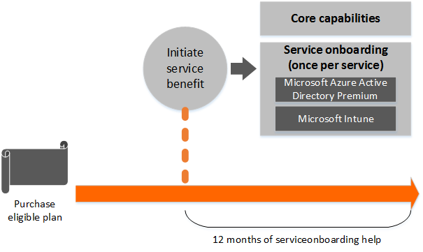

# Using Azure Rights Management
> [!NOTE]
> This information is for IT administrators and consultants who have deployed Microsoft Azure Rights Management (Azure RMS). If you are looking for user help and information about how to use Rights Management for a specific application, use the help and guidance that accompanies your application.
> 
> For example, for Office applications, click the Help icon and enter search terms such as **Rights Management** or **IRM**. For the RMS sharing application for Windows, see the [Rights Management sharing application user guide](http://technet.microsoft.com/library/dn339006.aspx).

[!INCLUDE[test test test](../../ems/AADRightsMgmt/includes/test-test-test.md)]

This section contains operations information for after you have configured   [!INCLUDE[aad_rightsmanagement_1](../../ems/AADRightsMgmt/includes/aad_rightsmanagement_1_md.md)]:

-   [Verifying Azure Rights Management](../../ems/AADRightsMgmt/verifying-azure-rights-management.md)

-   [Helping Users to Protect Files by Using Azure Rights Management](../../ems/AADRightsMgmt/helping-users-to-protect-files-by-using-azure-rights-management.md)

-   [Logging and Analyzing Azure Rights Management Usage](../../ems/AADRightsMgmt/logging-and-analyzing-azure-rights-management-usage.md)

-   [Operations for Your Azure Rights Management Tenant Key](../../ems/AADRightsMgmt/operations-for-your-azure-rights-management-tenant-key.md)

> [!TIP]
> If you’re new to Azure RMS, you might find the [Getting Started with Azure Rights Management](../Topic/Getting%20Started%20with%20Azure%20Rights%20Management.md) section useful, because it contains information to help you learn more about Azure RMS and how it can help you to protect information in your organization.
> 
> If you’re looking for deployment instructions for Azure RMS, see [Configuring Azure Rights Management](../../ems/AADRightsMgmt/configuring-azure-rights-management.md). And if you’re a Windows PowerShell user, or just want to see how you can administer Azure RMS from the command line, see [Administering Azure Rights Management by Using Windows PowerShell](../../ems/AADRightsMgmt/administering-azure-rights-management-by-using-windows-powershell.md).

## See Also
[Azure Rights Management](../Topic/Azure%20Rights%20Management.md)

